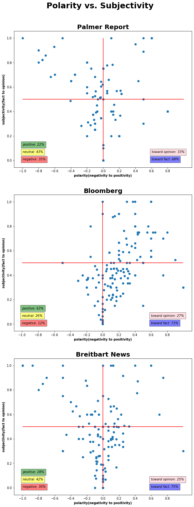

# Sentiment Analysis of News Outlets


## Directory Structure

```
.
├── sentiment_analysis
    ├── scraping.py
    ├── Twitter_Sentiment_Analysis.ipynb
    ├── data
        ├── bloomberg.csv
        ├── breitbart_news.csv
        ├── palmer_report.csv
    ├── images
    ├── README.md
```

## Project Outline / Problem Statement

The objective of this project was to do compare the sentiments of three news media outlets: conservative, liberal and neutral. Based on a graph found on [ad fontes media](https://www.adfontesmedia.com/the-chart-version-3-0-what-exactly-are-we-reading/#post/0), I chose Breitbart News as conservative, Palmer Report as liberal, and Bloomberg as neutral. The data was gathered through Twitter API with tweepy and the latest 200 tweets from each respectively was scraped. With TextBlob the polarity and subjectivity of each tweet was calculated. Also, extensive EDA was done on the data, looking at: number of likes and retweets, looking at the most liked and retweeted posts, source of the tweets, and most popular words of each outlet. 


---
## Description of Data

|Feature|Type|Description|
|---|---|---|
|**id**|int|The integer representation of the unique identifier for this Tweet|
|**author**|str|Author of the tweet|
|**length**|int|Length of the full text of the tweet|
|**created_at**|str|UTC time when this Tweet was created (gathered as str)|
|**like_count**|int| Indicates approximately how many times this Tweet has been liked by Twitter users|
|**retweet_count**|int|Number of times this Tweet has been retweeted|
|**full_text**|str|The actual text of the status update|
|**source**|str|Utility used to post the Tweet, as an HTML-formatted string|

---

### Source

The data was gathered from:

- [Palmer Report Twitter](https://twitter.com/PalmerReport)
  
- [Breitbart News Twitter](https://twitter.com/BreitbartNews)

- [Bloomberg Twitter](https://twitter.com/Bloomberg)


---
## Data Visualization



------------------------------------- 

---

